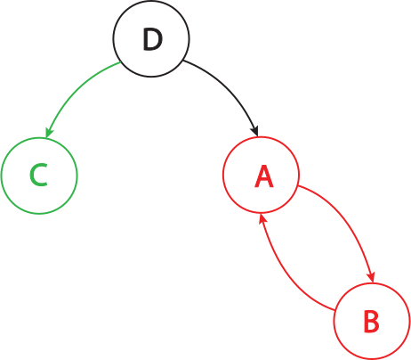
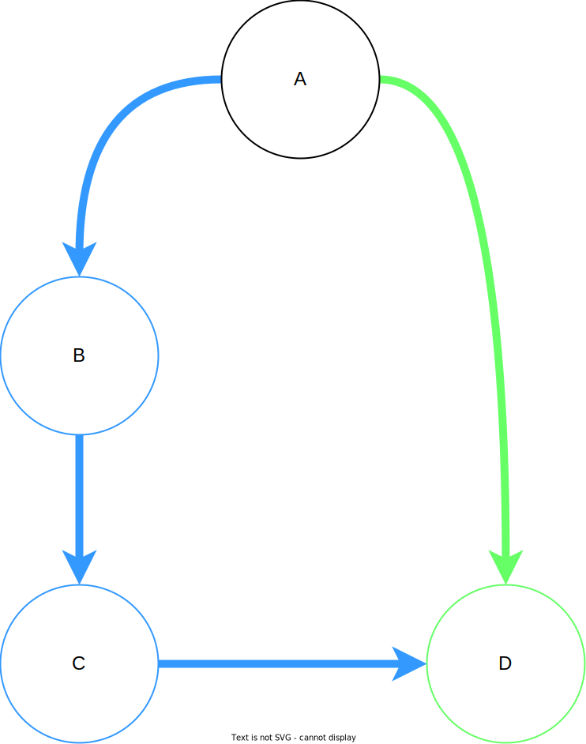

## Introduction

More and more programs today are being programmed as multithreaded applications.
The goal of this MP is to give you more practice writing multithreaded applications and to expose common pitfalls that occur while designing a program to work in a parallel manner.
Additionally, you will need to make use of synchronization primitives to protect the memory shared amongst the threads.

You are given a task of writing an application which will imitate the common `make` utility.
`make` is a utility that automatically builds executable programs from source code by reading files called `Makefiles` which specify how to derive the program.
You have encountered Makefiles in CS 341 MPs as well as in your previous undergraduate CS classes and should be familiar with them.

We have provided the code to parse a `Makefile` and list the dependencies and commands specified in the file.
Once the file is parsed, you will need to perform the actions specified by the `Makefile` following the rules specified later in the docs.
Using a fixed pool of threads, you will parallelize this execution process such that all commands are executed as soon as their dependencies are satisfied.

Before starting you should read the Wikipedia article on [Make](http://en.wikipedia.org/wiki/Make_(software)).

You might also want to look [here](https://web.archive.org/web/20170202011246/http://www.cs.umd.edu/class/fall2002/cmsc214/Tutorial/makefile.html) for some notes that explain makefiles really well.
(They start with some C++ specific details but you can skip to the 'Now, makefiles' section. Also, do note that the makefile for this MP does NOT use makefile macros.)

## Resource Allocation Graphs

A good way to think about this MP at a high level is by using a model [covered in lecture](http://cs341.cs.illinois.edu/coursebook/Deadlock#resource-allocation-graphs), Resource Allocation Graphs. You can think of `make` rules as nodes in the graph and dependency relations as directed edges that point from rules to dependencies. This visualization comes in handy when we are dealing with programs that may encounter deadlock. Given that a `Makefile` may contain a circular dependency (what are the required conditions for a program to deadlock?), keep this model at the back of your mind when building your solution.

Here is an example Makefile:

    d: a c
    	echo D
    a: b
    	echo A
    b: a
    	echo B
    c:
    	echo C

The following graph represents the above Makefile. Note that 'a' and 'b' form a cycle (-> 'b' -> 'a' ->).



Note that not all Makefiles form RAG-like graphs, so your cycle detection from `deadlock_demolition` may not work here! Does the graph below have a cycle? 



Some more resources on RAGs & Deadlock: [Wikipedia](https://en.wikipedia.org/wiki/Deadlock).

## Program Inputs

The input for this MP will be in the following form:

```
./path/to/parmake [-f path/to/makefile] [-j positive-integer] [targets ...]
```

The input parsing step is already handled for you in `parmake_main.c`. The Makefile, thread count, and target list will be provided as arguments to the `parmake()` function, which you will have to implement.

## Process the Makefile

The first thing you will need to do is to parse the Makefile into a dependency graph.

The Makefile will always consist of one or more rules of the form:

```
target [target ...]: [dependency ...]
    [command 1]
    .
    .
    [command n]
```

For example:

```
rule1: rule2 rule3
    commandtoberun withargs
    commandtoberun2 withargs

rule2:
    othercommand

rule3 rule4:
    finalcommand
```

You may want to take a look at the [Wikipedia page](https://en.wikipedia.org/wiki/Make_(software)) if you do not know how to read or write a basic Makefile. However, you will not need to parse the Makefile yourself. Instead,
you must use the `parser_parse_makefile()` function to represent the Makefile as a dependency graph.

`parser_parse_makefile()` takes the filename and a `NULL`-terminated array of strings as inputs.

The array of strings specify the targets you are planning to run. Remember, if the array is null or empty, the parser will use the first target found in the Makefile. The parser returns a graph data structure containing all rules and dependencies in the `Makefile`, *including those that do not need to be executed*.

For example, suppose we have the following Makefile:

```
a: b c
    echo A
b: c
    echo B
c:
    echo C
d:
    echo D
```


The parser will return a graph containing 5 vertices, once each for rule 'a', 'b', 'c', and 'd', as well as one sentinel (labeled as an empty string) whose neighbor is rule 'a' (i.e. the only [goal](https://www.gnu.org/software/make/manual/html_node/Goals.html) rule).

Those curious of the implementation can view the source in `parser.c` although this is not necessary.

We have provided an implementation of a vector, a set, a dictionary, a graph, and a thread-safe queue. This is the same queue from luscious locks and the same vector you've used in prior assignments. The set, graph, and dictionary are new data structures from the CS 341 provided library.
You can view the header information in `includes/`.

## Graph Data Structure

Since a Makefile is a representation of a dependency graph, our parser returns a directed graph data structure. You may find the graph API in `includes/graph.h`. To access Makefile rules from this graph, you would use
```
rule_t * rule = (rule_t *)graph_get_vertex_value(dependency_graph, target)
```

where `target` is a string labelling a rule. To get a list of all targets, use

```
vector *targets = graph_vertices(dependency_graph)
```

To get a list of all the dependencies of a rule with a given target, use

```
vector *dependencies = graph_neighbors(dependency_graph, target)
```

The graph returned from the `parmake` parser will contain all the vertices and edges depicting rules and dependencies in a Makefile. In addition, it will contain an empty sentinel rule (with key "") whose neighbors are the goal rules. *Do not execute this rule*. Instead, you should only work on rules that descend from this rule (i.e. the goal rules and all their descendants). Here, "B descends from A" means that 'A' implicitly depends on 'B' to run.

See `rule.h` for a description of the `rule_t` API. And read `parser.h` for more usage details on the dependency graph.

**USAGE WARNINGS**:
* Any vectors returned from graph functions must be destroyed manually to prevent memory leaks. Destroying these vectors will not destroy anything in the actual graph.

* Destroying the graph or removing vertices from the graph will completely destroy all associated targets (i.e. rule labels), rules, and edges. So copy anything you need for later use before removal or destruction.
* You should not add new vertices to the graph. If you choose to do this using `graph_set_vertex()`, keep in mind that both the key and value must be *strings*, since the graph's value copy constructor transforms strings to new `rule_t` structs. Read `parser.c` in order to understand the dependency graph's memory management scheme.

* **The graph and vector classes are *not* thread-safe!** You must enforce mutual exclusion if multiple threads are to concurrently modify and access these structures.

## Graph Searching and Cycle Detection

GNU `make` handles cyclical dependencies by attempting to delete edges that cause cycles. If you tried to call `make d` on the example Makefile shown earlier, GNU `make` would essentially attempt to convert that Makefile to this one:

    d: a c
    	echo D
    a: b
    	echo A
    b:  #a (comment out 'a': no more cycles if you remove this edge!)
    	echo B
    c:
    	echo C

To highlight the importance of cycle detection in resource allocation schemes, we also require that you explicitly handle cycles. However, *your implementation of parmake will ignore all goal rules whose descendants belong to cycles*. That is, calling `./parmake d` on this makefile would execute nothing, since 'd' cannot be satisfied due to the cyclical dependency (-> 'a' -> 'b' ->). However, calling `./parmake c` will still execute `echo C`, since the (nonexistent) descendants of 'c' don't belong to cycles.

Moreover, you must announce any goal rules that are dropped due to existence of cyclical dependencies using the function `print_cycle_failure()` found in `format.h`. Read the header file for usage information.

Since this MP requires you to implement some graph algorithms, you may want to consult [this resource](http://www.cs.cornell.edu/courses/cs2112/2012sp/lectures/lec24/lec24-12sp.html) to jog your CS 225 memory.

Note: You do NOT have to parallelize cycle detection and essential rule extraction. You only need to parallelize the execution of commands.


## Satisfy the rules

Each rule depends on a (possibly empty) set of other rules. It is important to note that every dependency will be a rule, even if the dependency isn't explicitly defined in the Makefile. For example, these two Makefiles are equivalent:

    # Makefile 1
    a: b
    	echo A
    # Makefile 2
    a: b
        echo A
    b:

Some rules might also be files on the disk. A rule can be satisfied if and only if all of rules that it depends on have been satisfied and none of them have failed (See what determines a failed rule in Running Commands).

Note that you shouldn't try to satisfy rules that aren't "good" goal rules and don't have any "good" goal rules as ancestors. Specifically, you should not try to satisfy a rule if any of the following is true:

1. the rule is a goal rule, but is involved in a cycle, i.e. there exists a path from the rule to itself in the dependency graph
2. the rule is a goal rule, but at least one of its descendants, i.e. any rule in the dependency graph reachable from the goal rule, is involved in a cycle
3. the rule is not a goal rule, and it has no ancestors that are goal rules
4. the rule is not a goal rule, and all of its goal rule ancestors fall under *(1)* or *(2)*

Basically, there is no need to satisfy a rule if it isn't necessary to satisfy the goal rules or if we already know that all the goal rules it might satisfy are doomed to fail due to cycles. Trying to satisfying any of them would be impossible at worst or a waste of time at best.

When a rule is ready to be satisfied, we must determine if we actually need to run the rule's commands. We run its commands if and only if at least one of the following is true:

*   The name of the rule is not the name of a file on disk.
    **Example:**

```
clean :
    rm -rf *
```

or

```
makenewfile:
    touch newfile
```

*   The rule depends on another rule that is not the name of a file on disk.
    **Example:**

```
clean : take_backup
    rm -rf *
take_backup :
    cp -r * ../backup
```

*   The rule is the name of a file on disk, and it depends on another file with a NEWER change time than the change time of the file which corresponds to the name of the rule. To determine whether a file is NEWER, you should use stat and difftime to determine if it is newer. The differences in time will have a granularity of 1 second.

If neither of these is true, then the rule is already satisfied and does not need its commands executed. Otherwise, the rule is unsatisfied and available to be run. Once a rule is satisfied, it shouldn't be run again.

### Running the commands

You can use `system()` to run the commands associated with each rule. There are a few conditions to think about when running these commands:

* The rule's commands need to be run sequentially in the order they appear in the command vector
* If any of a rule's commands fail while evaluating that rule, then the rule should "fail" and no more of its commands should be run
* If a rule fails, its parent rules (rules which have this rule as a dependency) should fail as well. Note that this is not necessarily true for the converse (i.e. if a parent fails, its children may still be satisfied)

For your convenience these rules are captured in the following flow chart:


## Parallelize! (Part 2 Only)

`parmake` must satisfy all of the rules needed to build the specified targets correctly and as quickly as possible. Because we want maximum runtime performance, you need to be running a rule on each worker thread whenever possible. Threads should not stay idle when there are rules that are available for execution. A rule is defined as available when all of its dependencies have been satisfied and it is not already satisfied (see "Satisfy the rules").

There are two important parallelism requirements:

* You should NOT run any rule unless its dependencies have been satisfied (all dependent rules have been run and none have failed; see the previous section)
* If a thread is available (not doing useful work), and there is at least one rule that is available to be executed, the available thread should work on executing that rule.

The exact type of work that your worker threads perform will generally depend on your implementation. But for the purposes of this MP, you *must* parallelize the actual execution of commands. If any rule is ready to have its commands executed, a worker thread should do so as soon as possible (i.e. within several milliseconds) unless all worker threads are already executing commands.

If a rule is available because all its dependencies have been satisfied, and some of your threads are still not executing any rules, then you probably haven't achieved maximum parallelization.

## Example

Suppose we have `makefile`:

```
a: b c
    echo A
b: c
    echo B
c:
    echo C
```

Running `./parmake` should output:

```
C
B
A
```

There are many more examples provided in your MP folder.

### Notes

* Only make changes in `parmake.c`.
* Note that Makefiles require tabs for indentation, so do not use spaces or modify tabs in editor settings if you plan on directly editing a `Makefile`. `cat -T` may be useful for detecting errors.
* You will receive 0 points if your implementation uses `sleep()`, `usleep()`, or any other form of timed waiting (e.g. `sem_timedwait()`).
* For full points, avoid busy-waiting. i.e. threads should not be burning CPU when they aren't doing useful work.
* You must only ever launch `T+1` threads, where `T` is the number of worker threads (+1 comes from the main thread). Do not keep re-spawning new threads for every rule.
* We will try to artificially create spurious wakeups, so think about how you would resolve those.
* To achieve a perfect score, you should maximize parallelization by ensuring that every given rule that can be run at a given time is being run.
* Because rules should be run as soon as they are available, there will sometimes be a well-defined, optimal order of rule execution when multiple threads are used. Think about why that might be the case.

## Compiling and Running


As usual, we have provided you with a Makefile which will compile your code in a variety of ways.
Unfortunately, you can't use `parmake` to compile `parmake`, because our parser does not support variables and variable expansions.

To compile in release mode, run `make`, for debug mode, use `make debug.`

### ThreadSanitizer
The provided `Makefile` also builds a ThreadSanitizer instrumented version of your code.
The tsan executable is `parmake-tsan`.
You can run this (instead of `parmake`) to use the ThreadSanitizer race condition detection tool with parmake.
For a tsan example, see [the tsan docs](https://clang.llvm.org/docs/ThreadSanitizer.html)

**We will be using ThreadSanitizer to grade your code! If the autograder detects a data race, you won't automatically get 0 points, but a few points will be deducted.**

### (Almost) a reference implementation
You can use the real GNU `make` to check your implementation. However, it differs from `parmake` in certain substantive aspects that may or may not be resolved. Here is a partial list of differences:
* `make` usually prints every command it runs. Run `make` with the flag `-s` (for silent) to suppress these.
* `make` deals with cycles differently than `parmake`, so do not use `make` as a reference for cycle handling.
* `make` kills the program immediately after a rule fails. Run `make` with the flag `-k` (for keep going) to continue satisfying rules that aren't doomed to fail.
* `make` requires every dependency to either be explicitly declared in the Makefile or present as a file on the disk. To get `parmake` and `make` to work the same way, define every rule explicitly.
* `make` spits out error messages when commands fail, even when the flag `-k` is used. `parmake` will not do this.


Example "good" Makefile:

    #testfile

    a: maybefile b c
    	echo "a"
    b:
    	cat / # always fails
    	echo "I should not print out."
    c:
    	echo "c"
    maybefile:

Example commands:

```
    $ ./parmake -f testfile -j 2
```

This should generate the same output as:

```
    $ make -s -k -f testfile -j 2
```

except maybe for some printouts that `make` emits when 'b' fails. Remember that you don't need to implement any GNU Make features that aren't prescribed in these docs.

## Grading

Here is the grading breakdown:

* Part 1 (50%): Create a single-threaded version of `parmake` (so just `make`). This version should:
	- identify cycles in the dependency graph returned by the parser and remove goal rules that depend on them
	- attempt to run all other goal rules by running all their descendants (i.e. implicit dependencies) and *only* their descendants
	- identify whether or not to run a rule as per the flowchart recipe and run it once possible (or reject it if not possible)
* Part 2 (50%): Create the full multi-threaded version of `parmake` (so `par`). This version should:
	- perform the same functions as in Part 1
	- run with 2-4 threads (excluding the main thread) for any given Makefile
	- concurrently run all rules whose dependencies have been satisfied, subject to the thread limit
	- avoid deadlock, data races, livelock, and busy-waiting
	- create performant code that doesn't incur excessive overhead (e.g > 10 ms per rule)
