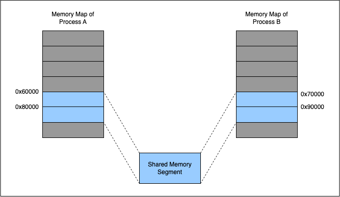

## Background

<vertical />

Binary Trees:


<vertical />

This is how we store them in arrays:


## Tree node structure

```C
typedef struct {
	uint32_t left_child;  // offset of node containing left child
	uint32_t right_child; // offset of node containing right child

	// Offsets are relative to the beginning of the file.
	// An offset of zero means the child does not exist.

	uint32_t count;  // number of times the word occurs in the data set
	float price;     // price of the word

	char word[0];    // contents of the word, null-terminated
} BinaryTreeNode;
```

## How does word[0] work?

```
// allocate 12 bytes for word
BinaryTreeNode* node1 = malloc(sizeof(BinaryTreeNode) + 12);
// allocate 20 bytes for word
BinaryTreeNode* node2 = malloc(sizeof(BinaryTreeNode) + 20);
```

<horizontal />

## C File Manipulation

## Fseek Juggle


## What to do in this lab

Read in the file provided. Skip the first 4 header bytes and then treat the next bytes as the metadata for the binary tree node. After that is the word - a C-string delimited by a null byte.

<horizontal />

## MMAP

## What is it?

mmap is a really cool function call. It uses memory mapped IO to emulate writing to files. This means that the file is loaded lazily into memory page by page and any writes write back to the original file. We can effectively treat files as memory, just like stack and heap memory.

## Remember this?


Now, the pages can be tied to file pages, instead of pages backed by physical RAM.


## Address Space


## MMAP for IPC


## Lazy MMAP

Mmapping is lazy! Entire files may not be mmapped, you may just use parts of files and assign them to memory pages as they are needed because you don't need a file until the first time you need it. When `mmap` is called, it is possible that *none* of the file is loaded into memory yet.

<vertical />

Just like the function name says, mmap creates a memory mapping in the kernel and the kernel/CPU is free to do whatever under the hood so long as when a process asks for a memory address it will get the correct bytes and when the write happens, the write eventually goes through to the actual disk.

## How do I use it?

Read the man page!
